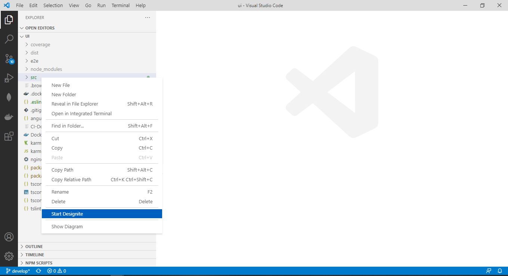

# Designite-ts

Designite-ts scans the Angular/TypeScript code for detecting design smells or design principal violations.
The Angular/TypeScript code must follow OOP approach in order to find smells.

The current version V0.1.0 can detect following 10 smells from the code:
- Imperative Abstraction
- Unnecessary Abstraction
- Deficient Encapsulation
- Broken Hierarchy
- Cyclic Hierarchy
- Deep Hierarchy
- Multipath Hierarchy
- Rebelious Hierarchy
- Wide Hierarchy
- Broken Modularization

## How to use

- Select and Right click the folder in the EXPLORER on which you want to run the tool
- Click on the 'Start Designite' menu option in context menu
- A file named designSmells.csv will be generated with the repot

## VS Code version supported
- V 1.56.0 or later