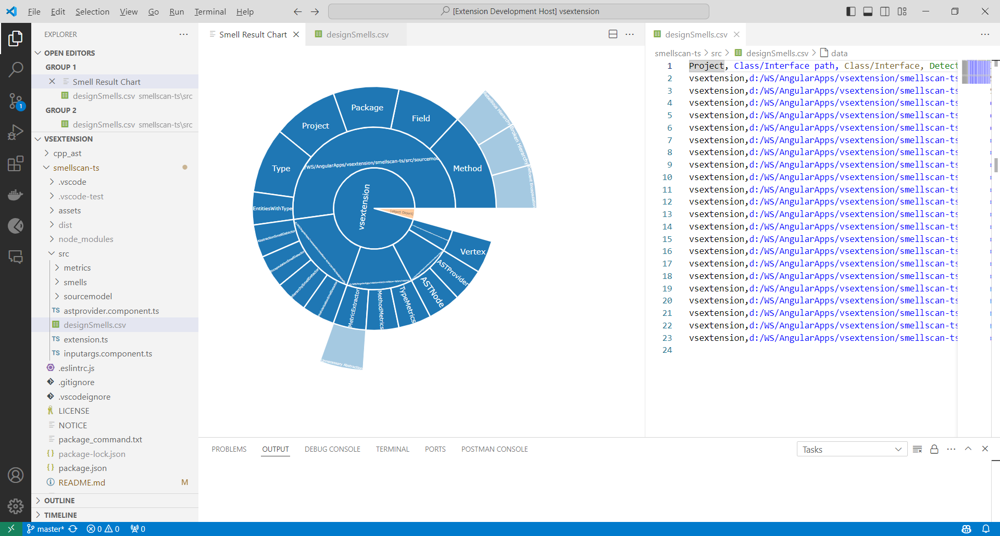

# 🕵️‍♀️ SmellScan-ts

SmellScan-ts is a 🔧 tool designed to scan Angular/TypeScript code for the detection of design smells or violations of design principles. It is essential that the Angular/TypeScript code follows an Object-Oriented Programming (OOP) approach for the tool to effectively identify design smells.

[Download the extension from here:] (https://marketplace.visualstudio.com/items?itemName=abhipsb.smellscan-ts)

## 🌟 Features

SmellScan-ts is capable of detecting the following 10 design smells in TypeScript code:

1. [Imperative Abstraction](https://www.tusharma.in/smells/IA.html) 📚
2. [Unnecessary Abstraction](https://www.tusharma.in/smells/UA.html) 📦
3. [Deficient Encapsulation](https://www.tusharma.in/smells/DE.html) 📉
4. [Broken Hierarchy](https://www.tusharma.in/smells/BH.html) 🧩
5. [Cyclic Hierarchy](https://www.tusharma.in/smells/CH.html) 🔁
6. [Deep Hierarchy](https://www.tusharma.in/smells/DH.html) 🏞️
7. [Multipath Hierarchy](https://www.tusharma.in/smells/MH2.html) 🛤️
8. [Rebellious Hierarchy](https://www.tusharma.in/smells/RH.html) 🚧
9. [Wide Hierarchy](https://www.tusharma.in/smells/WH.html) 🌐
10. [Broken Modularization](https://www.tusharma.in/smells/BM.html) 🧱

## 🚀 Usage

To use SmellScan-ts after installing the extension on VS Code, follow these steps:

1. Select and right-click the folder in the EXPLORER that you wish to scan. 📂
2. Click on the 'Start SmellScan' option in the context menu. 🖱️
3. A file named `designSmells.csv` will be generated containing the report. 📄
4. For enhanced visualization, a Sunburst chart will also be generated. 🌅

## 🤝 Contributing

We welcome contributions, issue reports, and feature requests! 🎉

To report issues, please visit:
- https://github.com/abhipsb/smellscan-ts 🐞

## 🆚 VS Code Compatibility

SmellScan-ts supports VS Code version 1.88.0 or later. 🎯

## 📚 Additional Information

SmellScan-ts is based on DesigniteJava and has been rewritten from scratch in TypeScript for scanning TypeScript code. For more information about design smells, please visit [Design Smells](http://www.designsmells.com/).

## 🔄 Change log

### Version 1.0.0 (2024-04-30)
- Added support for generating Sunburst chart for enhanced visualization.
- Improved performance and accuracy of design smell detection.

### Version 0.1.2 to 0.1.6 (2021-06-02 to 2024-04-25)
- Initial releases of SmellScan-ts
- Added support for detecting Imperative Abstraction, Unnecessary Abstraction, Deficient Encapsulation, Broken Hierarchy, Cyclic Hierarchy, Deep Hierarchy, Multipath Hierarchy, Rebellious Hierarchy, Wide Hierarchy, and Broken Modularization design smells.
